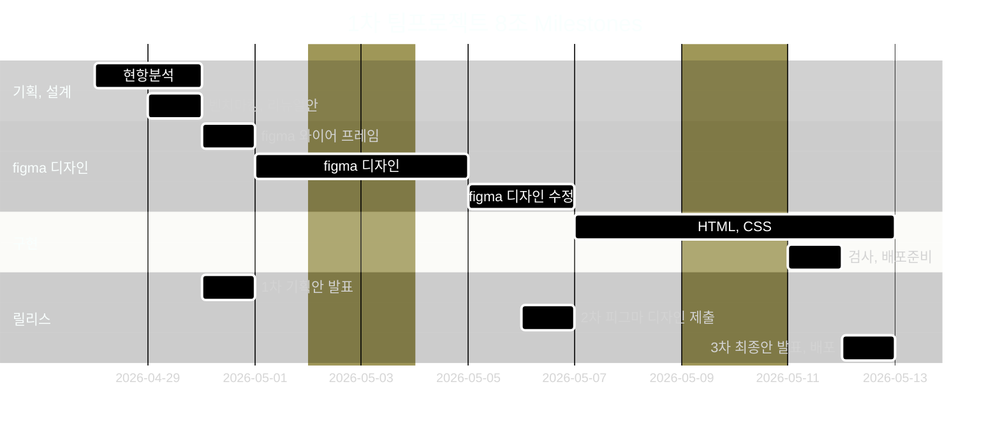

# 1st Team Project 8(1차 프로젝트 8조

- 과정명: 프로젝트기반 프론트엔드 개발자 양성(Figm/HTML/css/JSREACT)
- 기간: 26/04/07 ~ 26/08/21
- 1차 프로젝트: 26/04/30 ~ 26/05/12

## 🔗 빠른 링크

- 📑 기획서(피그마 슬라이드):https://www.figma.com/slides/jpFNlU0RKVM4rKhl0MYZOL
- 🎨 디자인 원본(피그마):https://www.figma.com/design/bVSC0HYCJuuoZ9XzhBBmkM/1%EC%B0%A8--%ED%8C%80-%ED%94%84%EB%A1%9C%EC%A0%9D%ED%8A%B8?node-id=0-1&t=TS6B4cLsRKB0WJRI-1

## 1. 프로젝트 개요

### 1.1 프로젝트 기획 및 배경

- **선정 배경**: 기존 이스트 캠프 프론트엔드 신청 페이지에 아쉬움을 느껴 리뉴얼을 기획하게 되었습니다.
- **기획 의도**: 사용자의 편의성과 신뢰성을 증가시키고 전반적인 사이트의 사용성을 개선하며, 웹 표준과 접근성을 철저히 준수한 페이지를 제작하고자 합니다.
- **차별화 된 내용**: 방문자에게 몰입감 있는 사용자 경험을 제공하고, 웹 접근성을 깊이 고려한 탄탄한 HTML 구조로 구현했습니다.

### 1.2 👥 팀원

| 이름   | 역할                                  | 주요 담당                                                                                                                                                           | GitHub                                                 | 연락                        |
| ------ | ------------------------------------- | ------------------------------------------------------------------------------------------------------------------------------------------------------------------- | ------------------------------------------------------ | --------------------------- |
| 최호찬 | 팀장,기획,발표,구현                   | 현황분석(웹표준&웹접근성) <br>벤치마킹 (트렌드)<br>section employment/section navigation. Section - Visual References for visual interest, Footer (Shared Component | [@starhochan70](https://github.com/starhochan70)       | (예) starhochan70@gmail.com |
| 이성희 | 팀원,기획, 디자인, 구현, GIt 담당     | 현황분석(반응형)<br>벤치마킹(반응형 웹)<br>HERO section, HERO Mega Menu section, Frontend section                                                                   | [@xoxoworld](https://github.com/xoxoworld)             | sung021125@gmail.com        |
| 맹예진 | 팀원, 기획, 디자인, 구현, 회의록 작성 | 현황분석(경제성)<br>벤치마킹 (비주얼)<br>Section features, Section company, Section differentiation, Section job status, Section portfolio                          | [@rkskek8484-cell](https://github.com/rkskek8484-cell) | rkskek8484@gmail.com        |
| 장진혁 | 팀원,기획, 디자인, 구현, 회의록 작성  | 현황분석(심미성 독창성 ) <br>벤치마킹(UX/UI)<br>Section testimonial, Section lecture, Section Curriculum, Section instructors                                       | [@wwg98](https://github.com/wwg98)                     | wwwg98@gmail.com            |
| 주성문 | 팀원, 기획, 디자인, 구현, 피그마 담당 | 현황분석(합목적성)<br>벤치마킹(내용)<br>Student Benefits Section, Section - Recruitment Overview, Section - FAQ                                                     | [@KimShueBang](https://github.com/KimShueBang)         | enforhssh@gmail.com         |

### 1.3 🗓️ 마일스톤

#### 1~3일차 — 프로젝트 이해 & 환경 세팅

- [ ] 사이트 분석, 현황 체크
- [ ] 벤치 마킹
- [ ] 리뉴얼 개선안 설정
- [ ] 페이지 구성 요소 목록 작성 (헤더, 네비게이션, 섹션, 푸터 등)
- [ ] 와이어 프레임 생성

#### 4~9일차 — figma 디자인

- [ ] 섹션별 초기 디자인 안을 구성
- [ ] Figma 디자인 분석 (레이아웃, 색상, 폰트, 이미지 등 파악)
- [ ] 필요한 이미지, 아이콘, 폰트 등의 자산 추출/준비
- [ ] 각 섹션별 더미 텍스트/이미지 삽입
- [ ] 피드백 후 배치, 디자인 수정

#### 10~15일차 — HTML, CSS 구현

- [ ] GitHub 저장소 생성 및 로컬 환경 연결
- [ ] 시맨틱 태그를 사용하여 전체 HTML 골격 작성
- [ ] 헤더/메뉴/메인 섹션/푸터의 기본 마크업 완료
- [ ] Figma 기준 색상, 폰트, 간격 적용
- [ ] 공통 스타일(리셋·폰트·변수) 적용
- [ ] 공통요소 스타일 적용
- [ ] 헤더·메인·푸터 등 주요 파트 스타일 완성
- [ ] 버튼·폼·이미지 등 세부 요소 스타일링

#### 14일차 — 검사, 배포준비

- [ ] 웹표준 & 웹접근성 검사 및 수정
- [ ] Figma와 디자인 비교·오차 수정
- [ ] 코드 정리 및 주석 작성
- [ ] 크로스 브라우저 테스트(Chrome, Edge 등)
- [ ] GitHub Pages 배포 설정 / 공유
- [ ] ReadMe.md 작성
- [ ] 배포 후 URL 공유
- [ ] 발표 리허설 & Q&A 준비

#### 15일차 — 발표

- [ ] 프로젝트 개요·디자인 특징·구현 과정 정리
- [ ] 스크린샷 및 시연 영상 준비
- [ ] 발표 리허설 & Q&A 준비
- [ ] 발표 진행



### 1.4 주요 기능

---

#### ✨ 주요 기능

- 부트캠프 과정 소개 및 커리큘럼 안내
- FAQ 아코디언을 통한 질문/답변 제공
- 수강 신청 유도를 위한 CTA(Call To Action) 섹션 구성
- 과정 특징 및 학습 방향 시각화
- 직관적인 섹션 구조를 통한 정보 전달

#### 📂 프로젝트 관리

- 프로젝트 등록(제목, 설명, 대표 이미지, 상세 이미지, URL, 리뷰 등)
- 이미지 업로드(Supabase Storage)
- GitHub 협업 및 Pages 배포

#### 🛠 구현 포인트

- HTML 시맨틱 태그 기반 마크업
- CSS Flex/Grid 레이아웃 구성
- Hover 인터랙션 및 아코디언 UI 구현

---

## 2. 개발 환경 및 배포

### 2.1 개발 스택

#### Frontend

- **Styling**: CSS Modules / Tailwind CSS

#### Tools

- **Version Control**: Git & GitHub

- **Design**: Figma

### 2.2 배포 URL

- **Production**: https://xoxoworld.github.io/EST_fe_13_1st_project/

---

## 3. 프로젝트 구조

```
EST_fe_13_1st_project/
├─ css/
│  ├─ common.css
│  ├─ flex-utility.css
│  ├─ index.css
│  ├─ normalize.css
│  └─ reset.css
├─ images/
├─ common.html
├─ index.html
└─ readme.md
```

## 4. 향후 개선 사항

- 반응형 UI 고도화
- 애니메이션/인터랙션 추가
- 이미지/ css 성능 최적화
- 컴포넌트 구조화

## 5. 실행 방법

### 1. 클론

```

git clone https://github.com/xoxoworld/EST_fe_13_1st_project


```

## 6. 제작 후기

이 프로젝트에서는 피그마를 활용해 전체 UI를 직접 디자인한 뒤, HTML과 CSS만으로 웹페이지를 구현해보는 경험을 했습니다.
반복되는 콘텐츠를 공통 스타일로 관리하고, Flex와 Grid를 활용해 정렬과 반응형 구조를 구현하면서 퍼블리싱의 중요성을 많이 배울 수 있었습니다.
마지막으로 팀워크로 코드를 구현하고 배포까지 협업의 중요성을 느낄 수 있었던 경험이었습니다.
또한 디자인과 실제 구현 사이의 차이를 직접 경험하며 웹 개발 과정에 대한 이해도를 높일 수 있었던 프로젝트였습니다.

## 7. 기획/디자인 문서

- **기획서(피그마 슬라이드)**: 사용자 여정, 화면 흐름, 요구사항, 마일스톤 정리
  링크: https://www.figma.com/file/XXXX
- **디자인 원본(피그마)**: 컴포넌트, 컬러/타이포 스케일, 반응형 레이아웃, 아이콘
  링크: https://www.figma.com/file/YYYY

### 7.1 미리보기

<!-- /public/readme/ 폴더에 썸네일 PNG를 넣고 경로를 맞춘다 -->

[](https://www.figma.com/file/XXXX "피그마 슬라이드로 이동")
[](https://www.figma.com/file/YYYY "피그마 디자인으로 이동")

```

```
